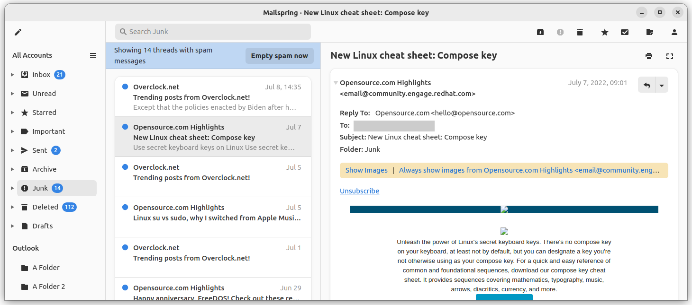
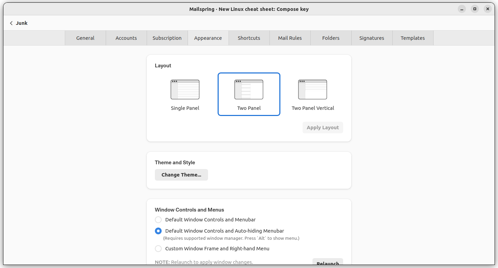
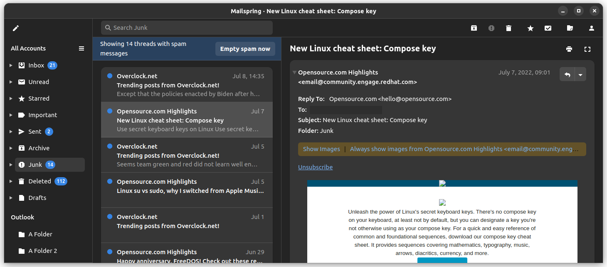
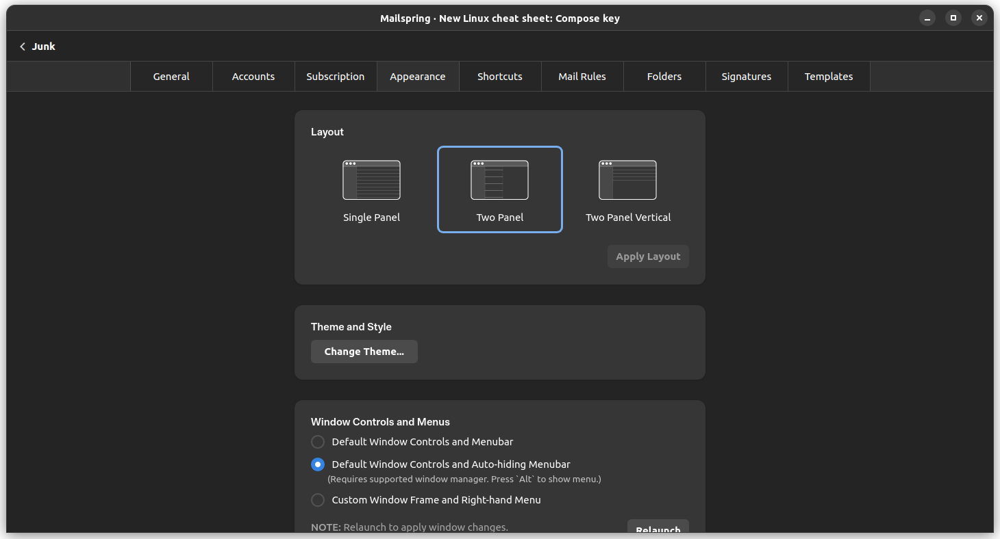

# Mailspring Libadwaita Theme

A theme for [Mailspring](https://github.com/Foundry376/Mailspring) that matches the new [Libadwaita](https://gitlab.gnome.org/GNOME/libadwaita) theme, includes light and dark variants.

## Screenshots

### Light variant
<div align="left"></div>
<div align="left"></div>

### Dark variant
<div align="left"></div>
<div align="left"></div>

## Installation

Clone the repository into your Mailspring configuration folder:

```bash
git clone https://github.com/drakkar1969/mailspring-libadwaita-theme ~/.config/Mailspring/packages
```

Restart Mailspsring and select the theme (`Edit -> Change Theme...`).

## Custom colors

Modify the color variables in the `Variant colors` section of `main.less` file for the selected variant:
* ~/.config/Mailspring/packages/Libadwaita/styles/main.less
* ~/.config/Mailspring/packages/Libadwaita-Dark/styles/main.less

## Papirus icons

The theme includes custom icons to match the Papirus icon theme. If you want to use Mailspring's own internal icons, delete the `papirus.less` file for the selected variant:
* ~/.config/Mailspring/packages/Libadwaita/styles/papirus.less
* ~/.config/Mailspring/packages/Libadwaita-Dark/styles/papirus.less
